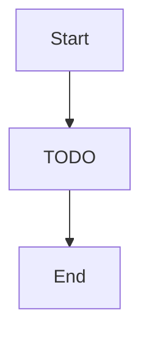

# Canvas — "The factory floor where machines get placed and belts connect them"

> XyFlow visual surface: nodes, connections, drag-drop, selection

**Paths:** src/components/canvas/**, src/hooks/**

<!-- Standards: see ~/.claude/skills/gabe-docs/SKILL.md (CommonMark + Mermaid + analogy-first) -->

---

## Purpose

The Canvas well owns the interactive visual surface where architecture components are placed, connected, and manipulated. It renders nodes (ArchieNode) and edges (ArchieEdge) via React Flow, manages selection and context menus, and hosts visual feedback systems: heatmap glows, status dots, flow particles, ripple animations, compatibility dimming during drag, ghost placement suggestions, and overlay badges. The canvas is the primary interaction layer — everything the user sees and touches on the factory floor.

## Key Decisions

### 2026-05-26 — StatusDot renders at component level, not edge level
Status dots show connection health (healthy/warning/bottleneck) on each node's corner rather than on edges. This gives per-node health visibility at a glance without cluttering the edge paths that already carry flow particles. The dot only renders when heatmapEnabled is true and the node has a computed heatmap status.

### 2026-05-26 — SwapPopover uses DOM measurement for positioning
The swap popover (triggered from radial menu) uses `getBoundingClientRect` against the React Flow node element to position itself adjacent to the target node. This avoids coupling to React Flow's internal coordinate system and works regardless of zoom/pan state. Trade-off: the component is harder to unit-test (jsdom lacks layout), so E2E tests carry the positioning verification.

### 2026-05-26 — Ripple animation is CSS-only with store-driven class toggle
Status-change ripples use a CSS `@keyframes` animation (`archie-ripple`, 200ms) triggered by adding/removing a class based on `rippleActiveNodeIds` in architectureStore. No JS animation loop — the store sets the node ID, a `setTimeout` clears it after the duration, and CSS handles the visual. Respects `preferencesStore.animationsEnabled`.

## Key Diagrams

<!-- Suggested diagram type for this well: flowchart -->

## Topics (auto-appended)

<!-- /gabe-teach topics appends verified topic summaries here on first run. -->
<!-- Do not edit the structure below this line; edit individual entries freely. -->
