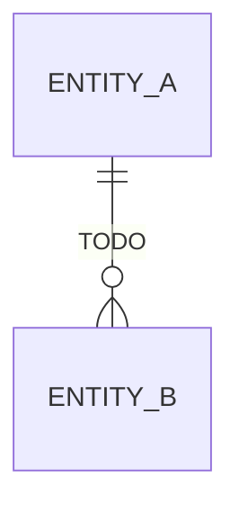

# Data Layer — "The blueprint string — everything the factory IS, encoded for sharing"

> Schemas (Zod), stores (Zustand), repositories, types, YAML import/export

**Paths:** src/schemas/**, src/stores/**, src/repositories/**, src/types/**, src/components/import-export/**

<!-- Standards: see ~/.claude/skills/gabe-docs/SKILL.md (CommonMark + Mermaid + analogy-first) -->

---

## Purpose

<!-- 2-3 sentences: what this section of the application does and why it exists. -->
<!-- Populated manually by the human, or auto-appended from verified /gabe-teach topics. -->

## Key Decisions

<!-- Load-bearing choices for this well. Each entry: date + one-line title + 1-2 paragraph rationale. -->

### 2026-05-27 — Typed Port System added to ComponentSchema (Epic 12, Phase 1)

`ComponentSchema` and `ComponentYamlSchema` now accept an optional `ports: PortDefinition[]` array. Each port has an `id`, a `type` (one of 7 values: http, database, cache, stream, monitor, auth, cdn), and a `direction` (in/out). The field is optional for backward compatibility with v2 component data — components without ports parse cleanly.

Port types are defined once in `src/lib/constants.ts` as `PORT_TYPES` (with jewel-tone hex colors and labels) and validated at import time via `PortDefinitionSchema` in `src/schemas/componentSchema.ts`. `PORT_SORT_ORDER` fixes the visual ordering for handle rendering in Phase 2. The Zod enum is derived from `Object.keys(PORT_TYPES)` so adding a new port type requires only one constant edit.

## Key Diagrams

<!-- Suggested diagram type for this well: erDiagram -->

## Topics (auto-appended)

<!-- /gabe-teach topics appends verified topic summaries here on first run. -->
<!-- Do not edit the structure below this line; edit individual entries freely. -->
