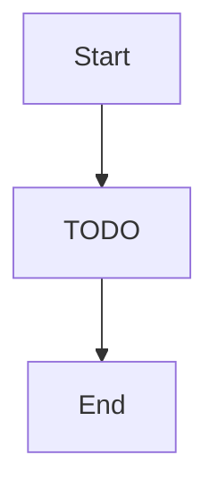

# UI Panels — "The production statistics screen and item tooltips"

> Inspector, dashboard, heatmap viz, toolbox, toolbar

**Paths:** src/components/inspector/**, src/components/dashboard/**, src/components/heatmap/**, src/components/toolbox/**, src/components/toolbar/**

<!-- Standards: see ~/.claude/skills/gabe-docs/SKILL.md (CommonMark + Mermaid + analogy-first) -->

---

## Purpose

<!-- 2-3 sentences: what this section of the application does and why it exists. -->
<!-- Populated manually by the human, or auto-appended from verified /gabe-teach topics. -->

## Key Decisions

<!-- Load-bearing choices for this well. Each entry: date + one-line title + 1-2 paragraph rationale. -->

## Key Diagrams

<!-- Suggested diagram type for this well: flowchart -->

## Topics (auto-appended)

<!-- /gabe-teach topics appends verified topic summaries here on first run. -->
<!-- Do not edit the structure below this line; edit individual entries freely. -->
