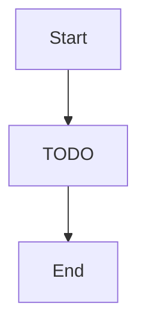

# Blueprints & Stacks — "The blueprint library — proven designs ready to stamp down"

> Pre-built architectures, stack browsing, component catalog

**Paths:** src/data/**

<!-- Standards: see ~/.claude/skills/gabe-docs/SKILL.md (CommonMark + Mermaid + analogy-first) -->

---

## Purpose

<!-- 2-3 sentences: what this section of the application does and why it exists. -->
<!-- Populated manually by the human, or auto-appended from verified /gabe-teach topics. -->

## Key Decisions

### 2026-05-28 — Component YAML files gain optional `ports` field (Epic 12, Phase 2)

Three component YAML files (nginx, node-express, postgresql) now include `ports` arrays with typed port definitions. This is the first batch of port data ahead of Phase 5's full 18-component authoring. Port data drives the new colored Handle rendering on the canvas — components with ports get jewel-tone colored dots; those without keep generic handles.

### 2026-05-30 — All 18 components now have typed port definitions (Epic 12, Phase 5)

Port definitions authored for all 15 remaining components (redis, redis-cache, kafka, rabbitmq, cloudflare-cdn, websocket-server, prometheus, siem, data-lake, graph-db, vector-db, etl-pipeline, llm-gateway, payment-gateway, serverless). 57 total port definitions across 18 components. All 7 port types (http, database, cache, stream, monitor, auth, cdn) have both in and out coverage. Three categories (auth-security, search, devops) remain empty — no component YAML files exist for them yet.

## Key Diagrams

<!-- Suggested diagram type for this well: flowchart -->

## Topics (auto-appended)

<!-- /gabe-teach topics appends verified topic summaries here on first run. -->
<!-- Do not edit the structure below this line; edit individual entries freely. -->
